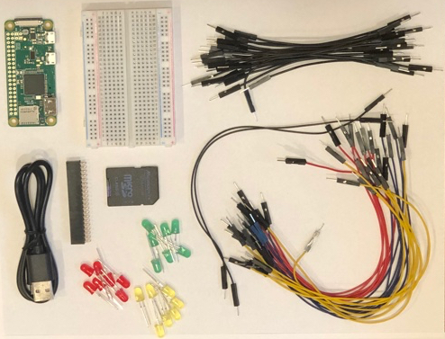

# Prerequisites

To complete the workshop, you will need some hardware and software. Purchased in bulk, the total cost of the workshop is approximately $22-25.

## Hardware

* [Raspberry Pi 3, Raspberry Pi 3 B+, Raspberry Pi 3 B+](https://www.adafruit.com/product/3055) or [Raspberry Pi Zero W](https://www.adafruit.com/product/3400) (It should have WiFi to sync time)
* [400 Tie Point Solderless PCB Breadboard](https://www.aliexpress.com/item/Free-Shipping-400-Tie-Point-Interlocking-Solderless-Breadboard-for-ATMEGA-PIC-400-Tie-Point-Solderless-Breadboard/32456722581.html?spm=a2g0s.9042311.0.0.45bb4c4dDZF8ht)
* [21 5mm LEDs](https://www.aliexpress.com/item/100pcs-5mm-LED-diode-Light-Assorted-Kit-DIY-LEDs-Set-White-Yellow-Red-Green-Blue-free/32323764461.html?spm=a2g0s.9042311.0.0.45bb4c4dDZF8ht)
* [21 10cm male breadboard jumper wires](https://www.aliexpress.com/item/Top-Quality-100pcs-1P-10CM-breadboard-jumper-wires-male-to-male-computer-wires-dupont-cable-jumper/32910299932.html?spm=a2g0s.9042311.0.0.60544c4djAvJZy)
* [23 20cm male breadboard jumper wires](https://www.aliexpress.com/item/Free-shipping-Drop-shipping-New-100pcs-New-Random-Color-1p-to-1p-18cm-male-to-male/1726192986.html?spm=a2g0s.9042311.0.0.60544c4djAvJZy)
* [8GB Micro SD Memory Card](https://www.aliexpress.com/item/New-design-Gold-Micro-SD-card-memory-cards-tf-card-4GB-8GB-16GB-32GB-64GB-real/32793083356.html?spm=a2g0s.9042311.0.0.45bb4c4dDZF8ht)
* [Micro USB Cable](https://www.aliexpress.com/item/CHOETECH-Micro-USB-2-0-Cable-5V-2-4A-1M-A-Male-To-Micro-B-Male/32688105310.html?spm=a2g0s.9042311.0.0.45bb4c4dDZF8ht)
* [Hammer Header Female - Solderless](https://www.adafruit.com/product/3663)
* [GPIO Hammer Headers - Solderless Raspberry Pi Connectors - Male + Female + Installation Jig](https://www.adafruit.com/product/3413) (optional but recommended)

## Software

* [Download Raspbian Stretch Lite](http://director.downloads.raspberrypi.org/raspbian_lite/images/raspbian_lite-2018-06-29/2018-06-27-raspbian-stretch-lite.zip)
* Download and install a Text Editor like [Visual Studio Code](https://code.visualstudio.com)
* Download and install [Etcher](https://etcher.io)
* Download and install [PuTTY](https://www.putty.org/) (Windows only)

---

[NEXT](setup.md)